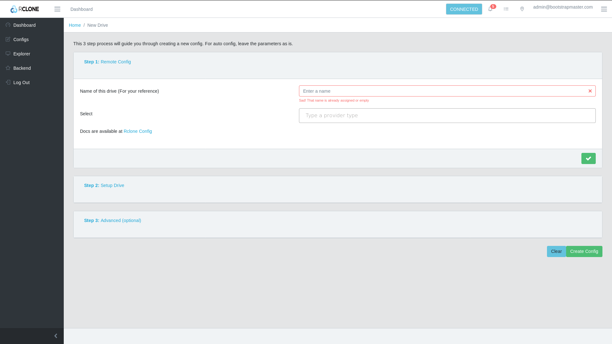

# Google summer of Code '19 RClone WebUI PHASE I

You can find more about rclone, at [rclone.org](http://rclone.org).

My project is to create a web UI for the rclone - 'rcsync for cloud storage'. You probably would have come across rsync, 

> "rsync is a utility for efficiently transferring and synchronizing files across computer systems, by checking the timestamp and size of files." - Wikipedia. 

What rclone is does, is it gives the same capability to be used with cloud storage providers. Pretty cool right? And what's more? It supports approximately 35+ cloud storage methods and widely used protocols like ftp, sftp and http. 

rclone makes it easy to copy, move, delete, synchronize, across remotes and even your local file system. This is one of the functionality that none of the cloud providers are willing to provide. They usually have a propitiatory user interface which can only connect to their service and usually does not offer you a lot of flexibility in terms of sync. 

rclone was written in Go. It is open source. Duh! and it offers all the mentioned functionality with a CLI tool. The major problem with this approach is that it makes it unreachable for the general public who don't know how to use the command line interface. You might think that most of the users of rclone will be programmers, but that is not true as well.

There are people using it as a plex drive in the cloud. Woah!., some are using it just to sync photos from one drive to the other. The rclone GitHub repository has over 200 contributors and everyday they solve 10+ issues. This is quite a booming community.

## Studying previous approaches for making an user interface

If you do a quick Google search, you will come across a tool known as rclone browser. This tool is native (Most of you might have guessed the issue), and supports Linux, Windows and Mac OS. So why the hassle of creating a new interface altogether? 

As you might have guessed, a native software is usually hard to maintain and is not accessible via the browser. The rclone browser was abandoned by it's creator mostly because he lost interest in the project.

## My plan

I have proposed to create a user interface accessible via a browser and offering all the functionalities that rclone has to offer.
Advantages of creating a web interface
Use anywhere via a browser.
Can be hosted on a remote machine.
Can be accessed on mobile devices.
Easy to use for non-tech users.
Easily extensible for adding new features.

### Project commencement. Week 1:
The first week of my plan involves creating a user interface for configuring a remote for the first time. 
Basically an intuitive guided setup that will not overwhelm a normal computer user. 

My plan is to divide the remote creation in a 3-step process:

#### Step 1
- Setup basic parameters like name `name` and `provider-type`. The list of providers will be listed by communicating with the rclone API.

#### Step 2
- Setup options like client secret, http url, empty trash or not, basic parameters that wont break anything major.
- Choose whether to edit the advanced parameters "for advanced users".

#### Step 3
- Optionally edit the advanced parameters like caching, timeout etc.

### Result

