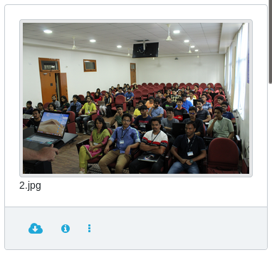
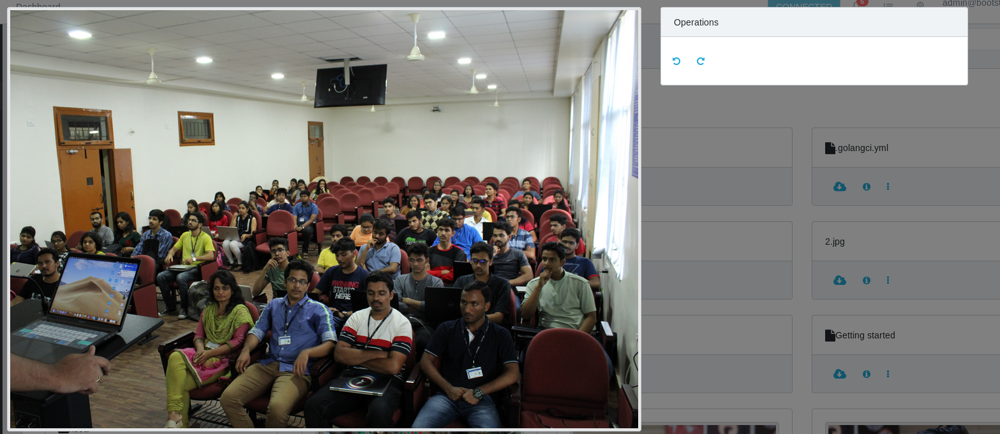

## Creating a new widget

There are some widgets that are created for you to get started with:

There are two modes a widget should be able to display:

1. Preview mode:
	- In this mode you have to display a small component which will be displayed along with the card in the files view.
	- This component can be clicked to get the full preview.

This is how your component will look like in the preview mode:



1. Full Mode:
	- This mode should ideally be loaded into a modal using the ``` React.createPortal()``` and passing in modal-root as the element id.
	
This is how your component will look like in the Full mode:



This should ideally create a full screen widget, but you can choose to overlay over the content if you wish to do so. Rclone can control the opening and closing of the modal.
